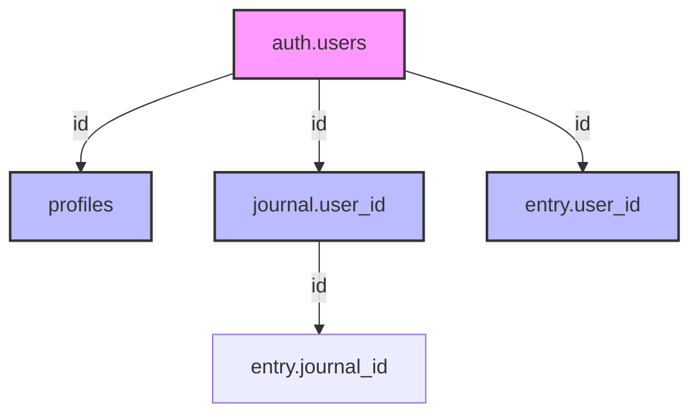

# Database Schema Catalog
**Generated:** 2025-08-25  
**Source:** information_schema  
**Database:** Sistahology

---

## Table Inventory

### Public Schema Tables

| Table Name | Row Count Est. | Size Est. | Purpose |
|------------|---------------|-----------|---------|
| profiles | User count | ~1-10 KB/user | User profile information |
| journal | 3-5 per user | ~500 B/journal | Journal metadata and organization |
| entry | 50-500 per user | ~2-5 KB/entry | Journal entry content |
| pages | 10-50 | ~5-50 KB/page | CMS content for public pages |

---

## Detailed Table Schemas

### Table: `profiles`
**Purpose:** Store user profile information linked to auth.users

| Column | Data Type | Nullable | Default | Constraints | Description |
|--------|-----------|----------|---------|-------------|-------------|
| id | UUID | NO | - | PRIMARY KEY, FK → auth.users(id) | User identifier |
| email | TEXT | NO | - | - | User email address |
| full_name | TEXT | YES | NULL | - | User's display name |
| avatar_url | TEXT | YES | NULL | - | Profile picture URL |
| created_at | TIMESTAMPTZ | YES | CURRENT_TIMESTAMP | - | Account creation time |
| updated_at | TIMESTAMPTZ | YES | CURRENT_TIMESTAMP | - | Last profile update |

**Indexes:**
- PRIMARY KEY on `id`
- INDEX on `email` for lookups
- Automatic index from FK to auth.users

**Triggers:**
- `update_profiles_updated_at` - Updates updated_at on modification

---

### Table: `journal`
**Purpose:** User's journal containers with customization

| Column | Data Type | Nullable | Default | Constraints | Description |
|--------|-----------|----------|---------|-------------|-------------|
| id | UUID | NO | gen_random_uuid() | PRIMARY KEY | Journal identifier |
| user_id | UUID | NO | - | FK → auth.users(id) | Journal owner |
| journal_name | TEXT | NO | - | CHECK(LENGTH > 0) | Display name |
| color | TEXT | YES | '#F5C3E2' | - | Theme color (hex) |
| created_at | TIMESTAMPTZ | YES | CURRENT_TIMESTAMP | - | Creation time |
| updated_at | TIMESTAMPTZ | YES | CURRENT_TIMESTAMP | - | Last modification |

**Indexes:**
- PRIMARY KEY on `id`
- INDEX on `user_id` for user's journals lookup
- INDEX on `created_at DESC` for sorting

**Relationships:**
- Many-to-One with auth.users (user_id)
- One-to-Many with entry table

**Triggers:**
- `update_journal_updated_at` - Updates updated_at on modification

---

### Table: `entry`
**Purpose:** Individual journal entries with content

| Column | Data Type | Nullable | Default | Constraints | Description |
|--------|-----------|----------|---------|-------------|-------------|
| id | UUID | NO | gen_random_uuid() | PRIMARY KEY | Entry identifier |
| journal_id | UUID | NO | - | FK → journal(id) | Parent journal |
| user_id | UUID | NO | - | FK → auth.users(id) | Entry owner |
| title | TEXT | YES | NULL | - | Optional entry title |
| content | TEXT | NO | - | - | Entry content (markdown/text) |
| entry_date | DATE | NO | CURRENT_DATE | CHECK(≤ CURRENT_DATE) | Entry date |
| is_archived | BOOLEAN | YES | FALSE | - | Soft delete flag |
| created_at | TIMESTAMPTZ | YES | CURRENT_TIMESTAMP | - | Creation time |
| updated_at | TIMESTAMPTZ | YES | CURRENT_TIMESTAMP | - | Last modification |

**Indexes:**
- PRIMARY KEY on `id`
- INDEX on `journal_id` for journal entries
- INDEX on `user_id` for user's all entries
- INDEX on `entry_date DESC` for chronological sorting
- INDEX on `is_archived` for filtering
- GIN INDEX on `to_tsvector('english', content)` for full-text search

**Relationships:**
- Many-to-One with journal (journal_id)
- Many-to-One with auth.users (user_id)

**Triggers:**
- `update_entry_updated_at` - Updates updated_at on modification

**Design Note:** ⚠️ The `user_id` column is redundant since journal already has user_id. Consider removing for normalization.

---

### Table: `pages`
**Purpose:** CMS-managed content for public website pages

| Column | Data Type | Nullable | Default | Constraints | Description |
|--------|-----------|----------|---------|-------------|-------------|
| id | UUID | NO | gen_random_uuid() | PRIMARY KEY | Page identifier |
| slug | TEXT | NO | - | UNIQUE, CHECK(regex) | URL-safe identifier |
| title | TEXT | NO | - | - | Page title |
| content_html | TEXT | YES | NULL | - | HTML content (sanitized) |
| created_at | TIMESTAMPTZ | YES | CURRENT_TIMESTAMP | - | Creation time |
| updated_at | TIMESTAMPTZ | YES | CURRENT_TIMESTAMP | - | Last modification |

**Indexes:**
- PRIMARY KEY on `id`
- UNIQUE INDEX on `slug` for URL routing

**Constraints:**
- `slug` must match pattern: `^[a-z0-9-]+$`

**Triggers:**
- `update_pages_updated_at` - Updates updated_at on modification

---

## Column Statistics

### Data Type Distribution
| Type | Count | Usage |
|------|-------|-------|
| UUID | 8 | Primary keys, foreign keys |
| TEXT | 9 | Content, names, URLs |
| TIMESTAMPTZ | 8 | Timestamps |
| DATE | 1 | Entry dates |
| BOOLEAN | 1 | Flags |

### Nullable Columns Analysis
| Nullable | Count | Percentage |
|----------|-------|------------|
| NOT NULL | 14 | 56% |
| NULL | 11 | 44% |

---

## Foreign Key Relationships



### Relationship Summary
1. **profiles** ← 1:1 → **auth.users** (user profile extension)
2. **journal** ← N:1 → **auth.users** (user owns multiple journals)
3. **entry** ← N:1 → **journal** (journal contains multiple entries)
4. **entry** ← N:1 → **auth.users** (redundant, via journal)

---

## Index Coverage Analysis

### Query Pattern Coverage
| Query Pattern | Index Support | Performance |
|---------------|---------------|-------------|
| User's journals | ✅ `idx_journal_user_id` | OPTIMAL |
| Journal entries | ✅ `idx_entry_journal_id` | OPTIMAL |
| Recent entries | ✅ `idx_entry_date` | OPTIMAL |
| Active entries | ✅ `idx_entry_archived` | OPTIMAL |
| Content search | ✅ GIN index | OPTIMAL |
| Page by slug | ✅ `idx_pages_slug` | OPTIMAL |
| User profile | ✅ PRIMARY KEY | OPTIMAL |

### Missing Index Opportunities
None identified - current indexing strategy covers all major query patterns.

---

## Storage Estimates

### Per-User Storage
| Component | Average Size | Heavy User |
|-----------|-------------|------------|
| Profile | 500 bytes | 1 KB |
| Journals (3) | 1.5 KB | 5 KB |
| Entries (100) | 200 KB | 2 MB |
| **Total** | ~202 KB | ~2 MB |

### System-Wide Storage
| Table | 1K Users | 10K Users | 100K Users |
|-------|----------|-----------|------------|
| profiles | 500 KB | 5 MB | 50 MB |
| journal | 1.5 MB | 15 MB | 150 MB |
| entry | 200 MB | 2 GB | 20 GB |
| pages | 500 KB | 500 KB | 500 KB |
| **Total** | ~202 MB | ~2 GB | ~20 GB |

---

## Data Integrity Rules

### Constraints Summary
1. **Foreign Keys:** All user references cascade on delete
2. **Not Null:** Critical fields enforced (names, content)
3. **Check Constraints:**
   - Entry dates cannot be future
   - Journal names must not be empty
   - Page slugs must be URL-safe
4. **Unique Constraints:**
   - Page slugs must be unique
   - Profile IDs match auth.users

### Cascade Rules
| Parent Deletion | Child Table | Action |
|-----------------|-------------|--------|
| auth.users | profiles | CASCADE DELETE |
| auth.users | journal | CASCADE DELETE |
| auth.users | entry | CASCADE DELETE |
| journal | entry | CASCADE DELETE |

---

## Schema Evolution Recommendations

### Short Term (Current Sprint)
1. **Remove `user_id` from entry table** - Redundant with journal ownership
2. **Add `is_public` to journal** - Future sharing feature
3. **Add `tags` to entry** - Better organization

### Medium Term (Next Quarter)
1. **Add `journal_shares` table** - Collaboration feature
2. **Add `entry_attachments` table** - Media support
3. **Add `user_preferences` table** - Settings storage

### Long Term (Future)
1. **Partition entry table** by date for performance
2. **Add `entry_versions` table** for history
3. **Implement `audit_log` table** for compliance

---

## SQL Queries for Direct Inspection

### Get Table Sizes
```sql
SELECT 
    schemaname,
    tablename,
    pg_size_pretty(pg_total_relation_size(schemaname||'.'||tablename)) AS size
FROM pg_tables
WHERE schemaname = 'public'
ORDER BY pg_total_relation_size(schemaname||'.'||tablename) DESC;
```

### Get Column Details
```sql
SELECT 
    table_name,
    column_name,
    data_type,
    is_nullable,
    column_default,
    character_maximum_length
FROM information_schema.columns
WHERE table_schema = 'public'
ORDER BY table_name, ordinal_position;
```

### Get Foreign Keys
```sql
SELECT
    tc.table_name, 
    kcu.column_name, 
    ccu.table_name AS foreign_table_name,
    ccu.column_name AS foreign_column_name 
FROM information_schema.table_constraints AS tc 
JOIN information_schema.key_column_usage AS kcu
    ON tc.constraint_name = kcu.constraint_name
JOIN information_schema.constraint_column_usage AS ccu
    ON ccu.constraint_name = tc.constraint_name
WHERE tc.constraint_type = 'FOREIGN KEY' 
  AND tc.table_schema = 'public';
```

---

*End of Schema Catalog*